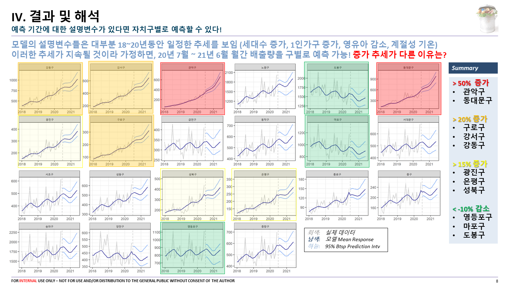

# 쓰레기, 누가 더 많이 버릴까?

## 서울시 자치구별 음식물 쓰레기 배출량에 대한 Linear Mixed Effects Model을 활용한 회귀분석, 예측 및 정책제언

**연세대학교 경제학과 (통계부전공) 강경훈**

연세대학교 응용통계학과 학부 임종호 교수님의 20-2 데이터사이언스(1) 수업에서 파이널 프로젝트로 준비한 자료입니다. 직접 데이터를 인터넷에서 찾아 하나의 데이터로 통합하면서 발생하는 결측치, key 매칭 등의 이슈를 해결하고, 데이터에서 Research question을 포착하여 통계적인 방법으로 답을 내려보는 프로젝트입니다. 데이터 통합은 팀 프로젝트로, Research question 제기 및 해결은 개인 프로젝트로 진행되었으며, 아래의 슬라이드는 개인 프로젝트의 결과물입니다.

어떤 주제를 해야 자료가 많을까 고민하다가 공공데이터포털에서 눈길을 끈게 음식물쓰레기였고, 마침 다행히도 서울시에서 각 자치구별로 공공데이터가 잘 정리되어 있어서 큰 어려움 없이 (많은 노가다와 함께) 데이터를 모을 수는 있었습니다. 그러나 여러 개의 지역에 대해 반복 측정된 횡단면 변수라는 새로운 형태의 데이터에 직면해, 어떤 방법론을 선택할지 많은 고민을 했었습니다. 그러던 중 이와 같은 **Panel data (longitudinal data)** 를 분석하는 널리 쓰이는 방법인 LMM 모델을 알게 되었고, 여기저기 찾아보고 교수님께도 물어보면서 어찌어찌 익혀 모델 학습까지 무사히 완료했습니다.

프로젝트를 하면서 해결하고자 했던 질문은 **왜 자치구별로 배출량 패턴이 다른가?** 였고, 그에 대한 저만의 답을 나름대로 내렸습니다. 예상했던 것처럼 배출량 패턴은, *다른 모든 변수가 일정할 때* 대부분의 자치구에서 시간에 따라 증가하는 경향을 보였습니다. 다른 변수 중에서는 1인가구의 영향이 두드려졌고, 똑같은 변수에 대해서 각 자치구별로 반응하는 양상이 다른 것을 알 수 있었습니다. 수집된 데이터와 모델이 말할 수 있는 것은 딱 여기까지입니다. 왜 1인가구에 대한 영향이 자치구별로 다른지, 왜 시간에 따라서 배출량이 증가하는지 그 이유에 대한 질문은, 관련 이슈에 대한 조예가 깊은 전문가들의 domain knowledge와 그 질문을 해결하기 위해 수집된 추가적인 데이터들이 필요하지 않나 생각합니다.

R마크다운 코드는

1. `FW_M_EDA_fitting.Rmd` 아래 프리젠테이션에 담긴 모든 그림 코드와 모델 코드
2. `DATAINTEG_M.Rmd` 각 변수별 데이터를 통합하여 시각화하는 코드
3. 그 외 `fw181920.Rmd`, `climate.Rmd` 등 개별 변수를 수집 및 처리하는 코드

로 이뤄져 있습니다. API로 자료 받아오기, 엑셀파일 읽기, tidyverse로 이리저리 요리조리 데이터 통합하고 시각화하는 노가다, ggplot2로 그림 그리기, 지도 그리기 등등 코드가 있는 거로 기억합니다.

Linear Mixed Effects Model을 공부할 때 가장 많이 참조했던 책과 사이트는 다음과 같습니다.

* [Extending the Linear Model with R (wordpress.com)](https://englianhu.files.wordpress.com/2016/01/faraway-extending-the-linear-model-with-r-e28093-2006.pdf) (Julian J. Faraway)
  이게 최고입니다 그냥 여기 챕터 10, 11 읽으면 됩니다. 엄밀한 증명과 정리는 대학원 수업을 들어야겠지만, 이 책의 내용을 이해하고 코드도 따라해보면 어렵지 않게 모델 돌릴 정도는 익힐 수 있습니다.
* [Introduction to Linear Mixed Models (ucla.edu)](https://stats.idre.ucla.edu/other/mult-pkg/introduction-to-linear-mixed-models/)
* [Linear Mixed Effects Models (webpopix.org)](http://sia.webpopix.org/lme.html)
* [When Mixed Effects (Hierarchical) Models Fail: Pooling and Uncertainty | by Eduardo Coronado Sroka | Towards Data Science](https://towardsdatascience.com/when-mixed-effects-hierarchical-models-fail-pooling-and-uncertainty-77e667823ae8)

자료나 코드 등에 대한 질문은 이메일 khoon5276@yonsei.ac.kr 로 해주시면 감사하겠습니다.

